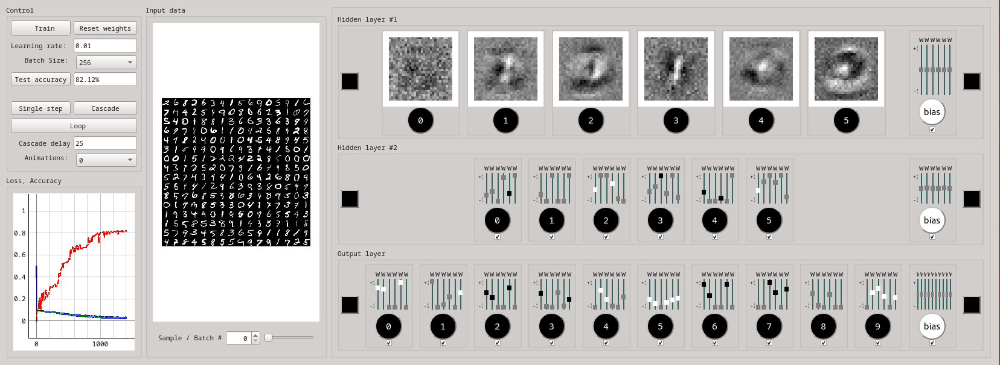

# MLP GUI



This repository contains a simple GUI application built using PySide6 that allows users to interactively play with the weights of a multilayer perceptron (MLP) neural network. The GUI provides sliders and other elements to adjust the weights of the neural network's layers, and users can observe the impact of these weight changes on the network's output.

## Features

- Adjust weights of different layers using sliders.
- Observe real-time updates to the network's output based on weight changes.
- Gain insights into how neural network weights affect predictions.

## Usage

1. Clone this repository to your local machine:

```bash
    git clone https://github.com/andriusbern/mlpy.git
    cd mlpy
    conda env install -f environment.yml
    conda activate mlp
    python mlpy.py


```